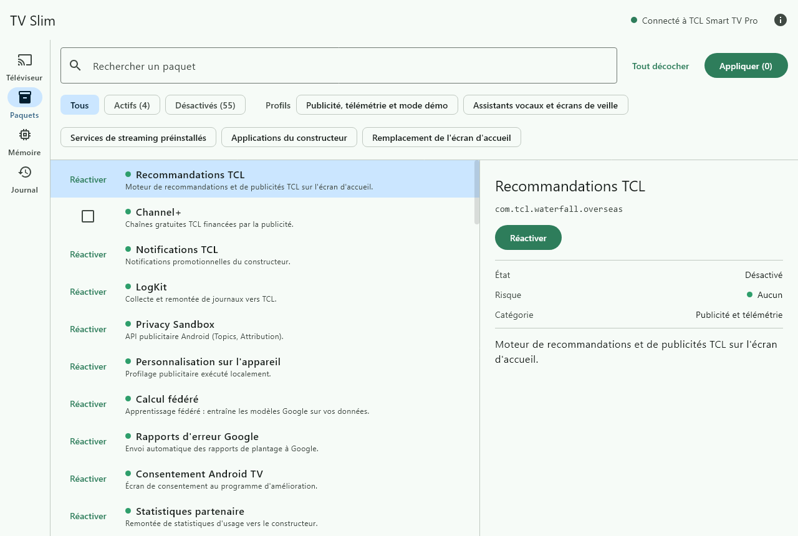

# TV Slim

**Le débloat réversible des téléviseurs Android.** TV Slim coupe la publicité, la télémétrie, les
restes du mode démonstration et les applications préinstallées qui alourdissent un téléviseur —
depuis un PC Windows ou depuis un téléphone Android — et tient un journal de chaque changement,
pour que chacun puisse être annulé.

Rien n'est jamais désinstallé : les paquets sont *désactivés*, et se réactivent à tout moment. Et
rien n'est à installer sur le téléviseur.

[English version](README.md)



## Télécharger pour Windows

La dernière version est sur la **[page des publications](https://github.com/jolabs40/TVSlim/releases)** :

| Fichier | Pour |
|---|---|
| `TVSlim-Windows-x.y.z.msi` | **Recommandé.** Installe TV Slim pour votre compte — sans droits d'administrateur — et le tient à jour. |
| `TVSlim-Windows-x.y.z-portable.zip` | S'utilise sans installation : décompressez, puis ouvrez `TV Slim.exe`. |

Windows 10 ou 11, 64 bits. Java est inclus : il n'y a rien d'autre à installer.

> **« Windows a protégé votre ordinateur » ?** TV Slim est un logiciel libre et gratuit, dont
> l'installateur n'est pas signé par un certificat payant : SmartScreen peut vous avertir la
> première fois. Cliquez sur **Informations complémentaires**, puis sur **Exécuter quand même**.
> `SHA256SUMS.txt`, publié à côté, permet de vérifier que le fichier est authentique.

## Préparer le téléviseur (une seule fois)

1. Sur le téléviseur, ouvrez **Paramètres → À propos** (parfois sous *Système* ou *Préférences de
   l'appareil*) et appuyez sept fois sur OK sur le **numéro de build**. Les options pour les
   développeurs apparaissent.
2. Dans les **options pour les développeurs**, activez le débogage réseau — selon le téléviseur, il
   s'appelle *Débogage réseau*, *Débogage ADB* ou *Débogage USB*.
3. Lancez TV Slim sur un PC branché au même réseau. Il trouve le téléviseur tout seul en quelques
   secondes ; sinon, saisissez son adresse IP (indiquée dans *Paramètres → Réseau*).
4. À la première connexion, le téléviseur demande d'**autoriser le débogage depuis cet ordinateur** :
   cochez *Toujours autoriser* et acceptez à la télécommande. Il ne le redemandera plus, même après
   un redémarrage.

## Ce qu'on peut faire

- **Téléviseur** — modèle et fabricant, version d'Android, mémoire, paquets actifs et désactivés ;
  l'écran d'accueil et les launchers installés, reconnus à leur logo, l'accueil d'usine compris même
  désactivé ; le remplaçant recommandé, Startlight Launcher (bientôt sur le Play Store) ; accorder
  les permissions privilégiées dont certaines applications ont besoin (`WRITE_SECURE_SETTINGS`,
  `DUMP`…).
- **Paquets** — les paquets connus réellement présents sur *votre* téléviseur, avec leur niveau de
  risque, leur taille, leur description et leurs effets de bord connus ; des profils prêts à
  l'emploi (publicité et télémétrie, assistants vocaux, services de streaming préinstallés…) ;
  application en une fois, après une confirmation qui liste les effets de bord. Sauvegarder la
  configuration du téléviseur — paquets et écran d'accueil — dans un fichier, et la réinjecter plus
  tard, sur le même téléviseur ou sur un autre du même modèle. Chaque paquet porte une icône
  d'origine : Android, constructeur ou autre. Ceux que TV Slim ne connaît pas encore sont listés à
  part, sans rien proposer d'en faire ; leur inventaire s'exporte — emplacement, droits du système,
  services sensibles déclarés, mémoire et stockage — pour enrichir le catalogue.
- **Mémoire** — mémoire vive : ce que coûte réellement chaque processus, et la comparaison
  avant/après depuis la première visite. Stockage : l'espace libre et occupé, et les applications
  les plus lourdes.
- **Journal** — chaque action, avec la commande qui l'annule ; annuler une seule ligne ou tout
  restaurer ; export en Markdown.

### Garde-fous

- Jamais de `pm uninstall` : uniquement `pm disable-user --user 0`, annulé par `pm enable`.
- Une liste de paquets protégés est refusée quelle que soit la sélection — ceux dont l'absence
  provoque une boucle de redémarrage ou casse la télécommande, par exemple.
- L'écran d'accueil d'usine ne se désactive pas tant qu'aucun launcher tiers n'est installé.

## Mises à jour

Au démarrage, TV Slim demande à GitHub s'il existe une nouvelle version — désactivable dans
**À propos**. Rien ne se télécharge avant un clic sur **Installer**. Chaque installateur est signé
par une clé Ed25519 : TV Slim vérifie la signature avant de l'exécuter, refuse tout le reste, puis
redémarre tout seul.

Chacun peut refaire cette vérification sur un fichier téléchargé, avec un JDK 17 ou plus récent,
depuis une copie de ce dépôt et avec le fichier `.msi.sig` à côté de l'installateur :

```sh
java "TVSlim Windows/outils/VerifierMiseAJour.java" TVSlim-Windows-x.y.z.msi x.y.z "TVSlim Windows/gradle.properties"
```

## Confidentialité

TV Slim parle à votre téléviseur sur votre réseau local, et à GitHub pour chercher les mises à
jour — à rien d'autre. Pas de compte, pas de télémétrie. La clé ADB qui permet à cet ordinateur de
parler à vos téléviseurs est gardée chiffrée par Windows (DPAPI) dans `%APPDATA%\TVSlim`, à côté des
journaux.

## Désinstaller

*Paramètres → Applications → TV Slim → Désinstaller*. Les journaux restent dans `%APPDATA%\TVSlim`,
au cas où il faudrait restaurer quelque chose plus tard ; supprimez ce dossier pour tout effacer.
Pour retirer à cet ordinateur l'accès à un téléviseur : *Options pour les développeurs → Révoquer
les autorisations de débogage USB*.

## Compiler depuis les sources

Il faut un JDK 21.

```sh
cd "TVSlim Windows"
./gradlew run          # lancer l'application
./gradlew jvmTest      # les tests, y compris ceux du noyau partagé avec Android
./gradlew packageMsi   # l'installateur, dans build/compose/binaries/main/msi
```

| Dossier | Contenu |
|---|---|
| `TVSlim/` | Applications Android : `core` (catalogue, moteur, garde-fous), `app-mobile` (TV Slim Remote), `app-tv` |
| `TVSlim Windows/` | Application Windows (Kotlin, Compose Multiplatform). Elle compile directement les sources du `core` Android : un seul catalogue, un seul moteur, un seul jeu de garde-fous. |

### Publier une version Windows

Poussez un tag annoté `windows-vX.Y.Z` : la chaîne teste, fabrique, signe et publie. La clé de
signature vient du secret `TVSLIM_CLE_SIGNATURE`. Un fork doit générer sa propre paire de clés
(`java outils/GenererCleSignature.java`) et remplacer `clePubliqueMisesAJour` dans
`gradle.properties` avant sa première publication.

## Licence

Voir [LICENSE](LICENSE).

TV Slim n'est affilié à aucun fabricant de téléviseurs, de box ou de launchers. Les noms et logos des
marques appartiennent à leurs propriétaires et ne servent qu'à identifier l'appareil ou l'application
détectés ; [NOTICE-LOGOS.md](NOTICE-LOGOS.md) dit d'où vient chacun. Startlight Launcher, que TV Slim recommande, vient du même auteur. Chaque changement que
fait TV Slim est réversible, mais vous restez maître de ce que vous désactivez.
