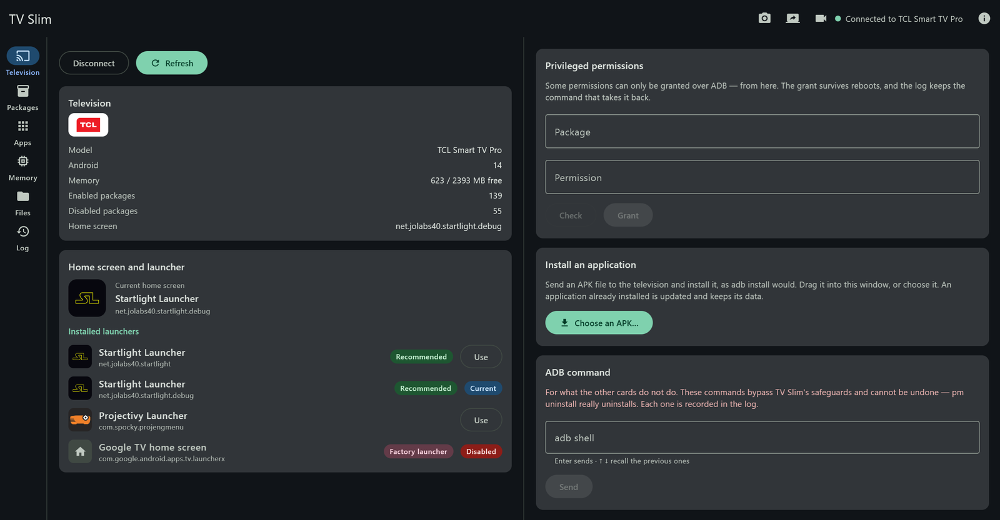
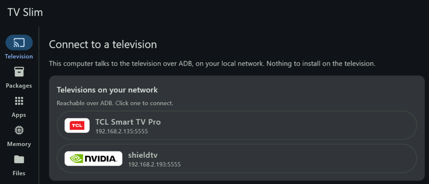
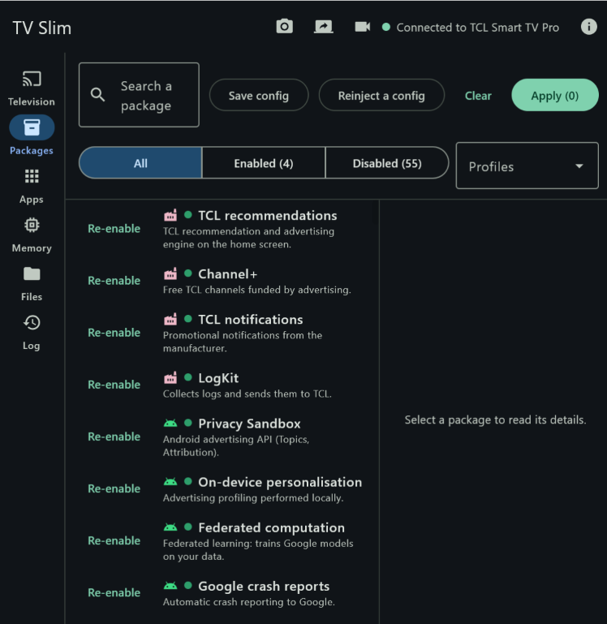
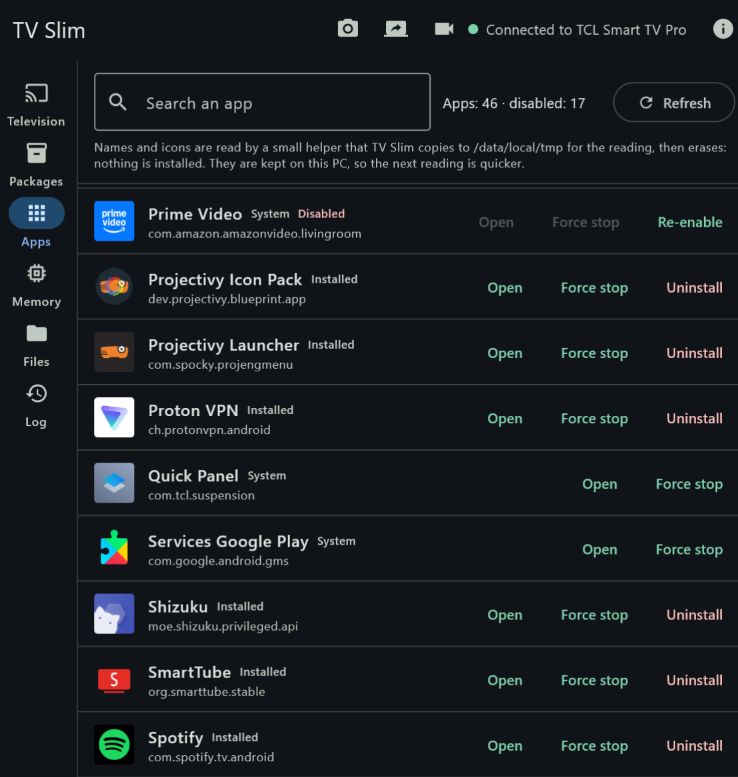

<p align="center">
  
</p>

<h1 align="center">TV Slim</h1>

<p align="center">
  <b>Debloat your Android TV or Google TV — without root, and with every change undoable.</b><br>
  Switch off the ads, the telemetry and the preinstalled apps that slow your smart TV down,
  from a Windows PC or an Android phone.
</p>

<p align="center">
  <a href="https://github.com/jolabs40/TVSlim/releases/latest"></a>
  <a href="https://github.com/jolabs40/TVSlim/releases/latest"></a>
  <a href="https://github.com/jolabs40/TVSlim/releases?q=android&expanded=true"></a>
  <a href="#faq"></a>
  <a href="LICENSE"></a>
</p>

<p align="center">
  <a href="https://github.com/jolabs40/TVSlim/releases/latest"><b>⬇ Download for Windows</b></a>
  &nbsp;·&nbsp; <a href="https://github.com/jolabs40/TVSlim/releases?q=android&expanded=true"><b>⬇ Android</b></a>
  &nbsp;·&nbsp; <a href="https://tvslim.app/"><b>tvslim.app</b></a>
  &nbsp;·&nbsp; <a href="#get-started-in-three-steps">Get started</a>
  &nbsp;·&nbsp; <a href="#faq">FAQ</a>
  &nbsp;·&nbsp; <a href="README.fr.md">Version française</a>
</p>



**TV Slim is a free, open-source debloater for Android TV and Google TV.** From a Windows PC or an
Android phone, it connects to your television over your home network with ADB, shows what is really installed on it, and disables the
advertising, the telemetry, the shop-demo leftovers and the preinstalled apps you never asked for —
on a TCL, a Philips, an NVIDIA Shield, a Xiaomi Mi Box and others. Nothing is uninstalled, and
nothing has to be installed on the TV: every package is *disabled*, written to a log with the
command that undoes it, and can be re-enabled at any time.

## Why TV Slim

- 🛡️ **Reversible by design** — packages are disabled, never uninstalled. Undo one line of the
  log, or restore everything in one click.
- 🔌 **No root, nothing to install on the TV** — plain ADB over Wi-Fi or Ethernet. TV Slim finds
  your television on the network by itself.
- 📖 **It tells you what you are disabling** — every package comes with a description, a risk level
  and its known side effects, plus ready-made profiles: ads and telemetry, voice assistants,
  preinstalled streaming services, maker apps.
- 🧱 **Safeguards you cannot click past** — packages that would cause a boot loop or break the remote
  are refused, and the factory home screen stays until another one is installed.
- 🔁 **Survives system updates** — when an update turns your ads or the Google TV home screen back
  on, TV Slim notices at the next connection and puts everything back after one confirmation.
- 🏠 **Ad-free home screen** — see the launchers installed, switch to Startlight, Projectivy or
  another one, and keep the factory home screen out of the way.
- 🧰 **Everything else ADB can do, with buttons** — apps (open, force-stop, uninstall your own),
  files in both directions by drag and drop, APK installation, screenshots, screen recording, live
  mirror, memory and storage.
- 🔒 **Private** — no account, no telemetry. TV Slim talks to your television and to GitHub for
  updates, nothing else.

## Screenshots

| Finds the TV on your network | Disabled packages, explained | Every app, with its real name |
|:---:|:---:|:---:|
|  |  |  |

## Get started in three steps

**1. Download TV Slim for Windows** from the **[Releases page](https://github.com/jolabs40/TVSlim/releases/latest)**:

| File | For |
|---|---|
| `TVSlim-Windows-x.y.z.msi` | **Recommended.** Installs TV Slim for your user account — no administrator rights — and keeps it up to date. |
| `TVSlim-Windows-x.y.z-portable.zip` | Runs without installing: unzip, then open `TV Slim.exe`. |

Windows 10 or 11, 64-bit. Java is bundled: there is nothing else to install.

> **“Windows protected your PC”?** TV Slim is free, open-source software, and its installer is not
> signed with a paid certificate, so SmartScreen may warn you the first time. Click **More info**,
> then **Run anyway**. `SHA256SUMS.txt`, published alongside, lets you check the file is genuine.

**…or TV Slim for Android**, from the **[Android releases](https://github.com/jolabs40/TVSlim/releases?q=android&expanded=true)**:

| File | For |
|---|---|
| `TVSlim-Remote-x.y.z.apk` | **The phone app**, TV Slim Remote — Android 8 or later. Open the file on the phone, and allow your browser or file manager to install apps when Android asks. |
| `TVSlim-TV-x.y.z.apk` | **Optional, for the television.** It shows a QR code the phone scans to connect, and keeps the TV reachable on the network during standby. Install it from TV Slim itself, with *Install an application*. |

TV Slim for Android is published here, not on the Play Store. Both APKs are signed with the same key,
whose certificate SHA-256 is
`42:96:BD:A0:51:8F:1A:59:1D:66:91:4E:6B:AB:7B:2F:0D:00:30:BE:6D:6C:79:8E:F3:AE:D5:D2:79:CF:96:F8` —
`apksigner verify --print-certs` shows it; `SHA256SUMS.txt` lists the files.

**2. Prepare the television (once).**

1. On the TV, open **Settings → About** (sometimes under *System* or *Device preferences*) and press
   OK seven times on the **build number**. Developer options appear.
2. In **Developer options**, enable network debugging — called *Network debugging*, *ADB debugging*
   or *USB debugging* depending on the TV.

**3. Connect and slim it down.** Start TV Slim on a PC or a phone connected to the same network. It
finds the TV by itself within a few seconds; otherwise, type its IP address (shown in *Settings →
Network*) — or, on the phone, scan the QR code of the TV app. On the first connection, the TV asks
to **allow debugging from this computer** (or this phone): tick *Always allow*
and accept with the remote — it will not ask again, even after a reboot. Then open **Packages**,
pick a profile and click **Apply**.

## Compatibility

- **Any Android TV or Google TV device** whose developer options offer network debugging: smart TVs
  (TCL, Philips, Sony, Hisense, Sharp, Toshiba, Grundig, Haier, Panasonic…) and TV boxes (NVIDIA
  Shield TV, Xiaomi Mi Box, Freebox, Google TV streamers…). TV Slim recognises the maker and shows
  its logo.
- **The catalogue** describes the packages of Google TV and Android TV, and those of TCL, Philips,
  NVIDIA and Xiaomi — and of Sony, not tested yet. Browse it, package by package, on
  [tvslim.app/packages](https://tvslim.app/packages/). On other makes, the packages TV Slim does not know yet are listed apart, with
  nothing offered to do about them, and *Propose to the catalogue* sends their inventory in a few
  clicks.
- **Tested** on a TCL Smart TV Pro (65C89K, Google TV, Android 14) and an NVIDIA Shield TV.
- **On the PC**: Windows 10 or 11, 64-bit. **On the phone**: Android 8 or later. Either one on the
  same local network as the TV.

## What you can do

- **Television** — model and maker, Android version, memory, enabled and disabled packages; the
  home screen and the launchers installed, recognised by their logo, the factory home screen
  included even once disabled; the recommended replacement, Startlight Launcher (coming soon to the
  Play Store); grant the privileged permissions some apps need (`WRITE_SECURE_SETTINGS`, `DUMP`…),
  picking the app from a list — name, then package — that shows the permissions it requests;
  install the optional TV Slim app for the television straight from its GitHub release (*Install from
  GitHub*): its signing certificate is checked before anything reaches the TV, then it gets its
  permission and its boot guardian is switched on; *Restart* the TV, and reconnect once it is back;
  install an APK on the TV — dropped into the window or chosen from your files — after a confirmation
  that shows the package, its version and what it replaces; send an ADB shell command of your own and
  read its output. If the TV has undone some of your changes — after a system update, typically —
  a card says so, and *Put them back* reapplies them.
- **Packages** — the known packages actually present on *your* TV, with risk level, size,
  description and known side effects; ready-made profiles (ads and telemetry, voice assistants,
  preinstalled streaming services…); applied in one go, after a confirmation that lists the side
  effects. Save the TV's configuration — packages and home screen — to a file, and reinject it
  later, on the same TV or on another one of the same model. Each package shows an origin icon:
  Android, maker or other. Those TV Slim does not know yet are listed separately, with nothing
  offered to do about them; their inventory can be exported — location, system rights, sensitive
  declared services, memory and storage — to help grow the catalogue. When some come from the
  maker, *Propose to the catalogue* exports it, then opens
  [a GitHub form](https://github.com/jolabs40/TVSlim/issues/new?template=nouvel-appareil.yml) to
  send it. A package described from such a report is marked *not tested*: no profile selects it.
- **Apps** — every app in the menu and every app you installed, with its real name and icon: open it
  on the TV, force-stop it, disable or re-enable it (under the same rules as the Packages tab), or
  uninstall an app you installed yourself. Android gives neither names nor icons through ADB: a small
  helper (a few KB) is copied to `/data/local/tmp` for the reading, run, then erased — nothing is
  installed — and what it reads is kept on your PC for the next time. Apps, memory and storage are
  read in the background as soon as the TV is connected, through a second ADB session: the tabs are
  ready when you open them, and the TV keeps answering what you ask in the meantime.
- **Memory** — RAM: what each running process really costs, and the before/after comparison since
  your first visit. Storage: free and used space, and the largest applications.
- **Files** — browse the TV's folders as in File Explorer: internal storage, Downloads, Movies, a USB
  drive or SD card plugged in… and drop files or a whole folder into them, subfolders included,
  dragged into the window or picked from your files. On Windows, copy a file or a folder to the PC,
  and delete what clutters the TV — by hovering over a line or with a right-click. The rights are
  those of ADB: shared storage is writable, `Android/data` included; system folders are not.
- **Screen** — from the top bar of every tab: a screenshot of the TV, saved in *Pictures\TV Slim*
  (on the phone, in the gallery) with a preview to copy or share it. On Windows, a video of the screen, recorded by the TV itself then copied into
  *Videos\TV Slim* and erased from the TV — without sound, which the TV's recorder never captures,
  and for 3 minutes at most before Android 14; and a live mirror of the screen in its own window,
  through [scrcpy](https://github.com/Genymobile/scrcpy), downloaded from GitHub the first time if it
  is not installed. Recording closes the mirror. Protected videos (Netflix, most channels) come out
  black: the TV decides that.
- **Log** — every action with the command that undoes it; undo a single line or restore everything;
  export as Markdown.

### Safeguards

- Nothing that came with the TV is ever uninstalled: only `pm disable-user --user 0`, undone by
  `pm enable`. The one exception is an app you installed yourself, which the Apps tab can uninstall
  after a confirmation — TV Slim checks right before that it is not a system package.
- A protected list is refused whatever the selection — packages whose absence causes a boot loop or
  breaks the remote control, for instance.
- The factory home screen cannot be disabled while no third-party launcher is installed.
- An APK is installed only after a confirmation, and never by uninstalling what is already there: an
  application signed with another key is left alone.
- Nothing is dropped on the TV before a confirmation that says what will be replaced. Nothing is
  erased there before a confirmation that says what goes — for a folder, how many files and how many
  gigabytes —, and a whole storage volume (internal storage, USB drive, the `Android` folder) is never
  erased in one go. A copy to the PC stopped halfway leaves no truncated file.
- The one exception is the **ADB command** card: what you type there bypasses these safeguards and
  cannot be undone from TV Slim. The card says so, and every command is recorded in the log.

## FAQ

### How do I remove the ads from my Android TV or Google TV home screen?

The ads come from the maker's recommendation service and from the factory home screen. In TV Slim,
the **Advertising, telemetry and store demo** profile disables the former — on a TCL, *TCL
recommendations* and *Channel+*, for instance. For a home screen with no ads at all, install another
launcher, choose it on the **Television** tab, then apply the **Replacing the home screen** profile,
which disables the Google TV home screen: TV Slim only allows that once a replacement is in place.

### Is debloating my TV safe? Can it brick it?

TV Slim only *disables* packages, and refuses the ones whose absence would cause a boot loop or break
the remote control. Every change is logged with the command that undoes it, and **Restore
everything** takes the TV back to where it started. As a last resort, a factory reset of the TV
re-enables every package — and *Reinject a config* applies your choices again afterwards.

### Do I need to root the TV?

No. TV Slim uses ADB, the debugging bridge every Android TV and Google TV device ships with. Turning
on network debugging in the developer options is all it takes.

### Does it install anything on the television?

Not unless you ask. The Apps tab copies a small helper to `/data/local/tmp` to read the names and
icons, runs it and erases it straight away. An APK — the optional TV Slim app for the television
included — is installed on the TV only when you ask for it.

### A system update brought the ads and the Google TV home screen back. What now?

Connect TV Slim again. It compares the TV with its log: if packages you had disabled are running
again, or if the factory home screen has taken over, a card says so, and *Put them back* reapplies
your changes after one confirmation.

### What is the difference with uninstalling packages over ADB?

`pm uninstall --user 0`, which many guides and phone debloaters use, removes the app for your user;
getting it back means finding the right command, and a factory reset may be the only way out of a
mistake. TV Slim never does that: it disables, explains each package before you touch it, keeps a
log you can undo line by line, and knows the packages that must never be touched on a television.

### Is it free?

Yes — free, open source under the Apache 2.0 licence, with no ads, no account and no telemetry. If
it has been useful to you, you can [buy me a coffee](#support-the-project).

## Updates

TV Slim asks GitHub for a new version when it starts — this can be switched off in **About**.
Nothing is downloaded until you click **Install**. Every installer is signed with an Ed25519 key:
TV Slim checks the signature before running it, refuses anything else, and restarts on its own.

Anyone can run the same check on a download, with JDK 17 or later, from a copy of this repository
and with the `.msi.sig` file next to the installer:

```sh
java "TVSlim Windows/outils/VerifierMiseAJour.java" TVSlim-Windows-x.y.z.msi x.y.z "TVSlim Windows/gradle.properties"
```

## Privacy

TV Slim talks to your television over your local network, and to GitHub to look for updates — and,
the first time you open the mirror without scrcpy installed, to download it from its GitHub
release, once you have agreed and after checking its fingerprint. Connected to a television or a
box, it also asks GitHub, once per launch, for the latest TV Slim app for the television, and
downloads it if you ask. Nothing else. No account, no
telemetry. The ADB key that lets this computer talk to your TVs is stored encrypted by Windows
(DPAPI) in `%APPDATA%\TVSlim`, next to the logs.

On the phone, TV Slim talks to your television, and to GitHub only for that TV app — once per
launch, connected to a television or a box, and to download it if you ask; its ADB key is encrypted
by the Android keystore. The QR code scanner is Google's, from Google Play services.

## Support the project

TV Slim is free and will stay that way. If it has been useful to you, you can buy me a coffee on
**[Ko-fi](https://ko-fi.com/jolabs40)**.

[](https://ko-fi.com/K7Z1286U38)

The application mentions it in two ways, no more: the Ko-fi cup in its top bar (and a link in
*About*), and a banner after a debloat, a file transfer or an APK installation that went through — at
most once a month. *I already donated* hides it for good. The application never contacts Ko-fi
itself: the button opens your browser.

A star on this repository helps other people find TV Slim, too.

## Contact

A question, a problem, a television that does not behave as described: write to
**[support@tvslim.app](mailto:support@tvslim.app)**. Bugs and new devices can also go through the
[GitHub issues](https://github.com/jolabs40/TVSlim/issues).

## Uninstall

*Settings → Apps → TV Slim → Uninstall*. Logs stay in `%APPDATA%\TVSlim`, in case something has to
be restored later; delete that folder to remove everything. To withdraw this computer's access to a
TV: *Developer options → Revoke USB debugging authorisations*.

On the phone, TV Slim Remote uninstalls like any other app — and its logs go with it. Export them
first (*Log → Export as Markdown*): they keep the command that undoes each change.

## Build from source

Requires JDK 21.

```sh
cd "TVSlim Windows"
./gradlew run          # start the application
./gradlew jvmTest      # tests, including those of the core shared with Android
./gradlew packageMsi   # installer, in build/compose/binaries/main/msi
```

| Folder | Content |
|---|---|
| `TVSlim/` | Android apps: `core` (catalogue, engine, safeguards), `app-mobile` (TV Slim Remote), `app-tv` |
| `TVSlim Windows/` | Windows app (Kotlin, Compose Multiplatform). It compiles the sources of the Android `core` directly: one catalogue, one engine, one set of safeguards. |

### Publishing a Windows release

Push an annotated tag `windows-vX.Y.Z`: the workflow tests, builds, signs and publishes. The
signing key comes from the `TVSLIM_CLE_SIGNATURE` secret. A fork must generate its own key pair
(`java outils/GenererCleSignature.java`) and replace `clePubliqueMisesAJour` in `gradle.properties`
before its first release.

## Licence

See [LICENSE](LICENSE).

TV Slim is not affiliated with any television, TV box or launcher maker. Brand names and logos
belong to their owners and are shown only to identify the device or the application detected;
[NOTICE-LOGOS.md](NOTICE-LOGOS.md) says where each one comes from. Startlight Launcher, which TV
Slim recommends, comes from the same author. Every change TV Slim makes is reversible, but you
remain in charge of what you disable.
